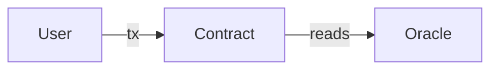

# ADR-NNN: <short title of the decision>

- **Status:** Proposed | Accepted | Superseded by ADR-MMM
- **Date:** YYYY-MM-DD
- **Deciders:** <roles/people>
- **Target chain(s):** <e.g. Ethereum mainnet, Base, Arbitrum>

## Context and problem statement

What are we building and what decision has to be made? State the problem in one or two sentences a newcomer could follow, then the surrounding facts.

- **System / feature:** <what it does>
- **Actors:** <users, LPs, admins, keepers, relayers, attackers>
- **Assets & value at risk:** <what an attacker gains by breaking each part — this ranks the whole analysis>
- **Trust assumptions:** <who/what must be trusted: admins, oracles, sequencer, bridge, multisig signers>
- **Constraints:** <chain, gas/cost budget, timeline, team, audit budget, custody/regulatory>
- **What "secure" and "success" mean here:** <the invariants that must hold no matter what>

> State any assumptions explicitly — a reader should never have to guess what you took as given.

## Decision drivers

The forces this decision is weighed against, roughly in priority order for *this* system:

- Security / blast radius of failure
- Cost (deployment + per-tx gas)
- Upgradeability & agility
- Decentralization / trust minimization
- Complexity & maintainability
- UX
- Composability & ecosystem fit
- Time-to-market

## Options considered

### Option A — <name>

How it works: <mechanism, key contracts, standards/libraries used>

| Driver | Consequence |
|---|---|
| Security | <specific — what it makes impossible, what it exposes> |
| Cost / gas | <deployment + runtime> |
| Upgradeability | <can it change post-deploy, and how> |
| Trust / decentralization | <who must be trusted> |
| Complexity | <build + audit burden> |
| Other | <UX, composability, time-to-market> |

### Option B — <name>

<same structure>

### Option C — <name> *(optional)*

<same structure. Drop clear non-starters in a single line rather than padding the list.>

## Security analysis of the leading option

Run the recommendation through `references/security-checklist.md`. Record what actually applies here, not a generic list.

- **Top threats:** <e.g. oracle manipulation via flash loan; upgrade-key compromise; reentrancy on withdraw>
- **Structural mitigations in the design:** <e.g. TWAP + Chainlink cross-check; timelock + multisig on upgrades; checks-effects-interactions + nonReentrant>
- **Residual risk (for auditors):** <what remains and where an audit should focus>
- **Key invariants to test:** <e.g. sum of user balances == contract balance; no path lets a non-owner withdraw>

## Decision

**Chosen option: <A/B/C>**, because <the deciding rationale, tied to the top decision drivers and the value at risk>.

Include a diagram if it clarifies the topology or the on-chain/off-chain split:

## Consequences

- **Positive:** <what we gain>
- **Negative / trade-offs accepted:** <what gets worse, stated plainly>
- **Risks & mitigations:** <residual risks and how they're handled>
- **Follow-ups:** <what needs an audit, which invariants to fuzz/formally verify, what to monitor, deployment/upgrade runbook, key-management setup>

> Reminder: no non-trivial contract system should hold real value before an independent audit and thorough invariant/fuzz testing. Note that here rather than assuming it.

## References

- EIPs/ERCs: <e.g. EIP-1967, EIP-2535, ERC-20, EIP-712>
- Implementations: <OpenZeppelin, Chainlink, Safe, Solady, …>
- Related ADRs / prior art
